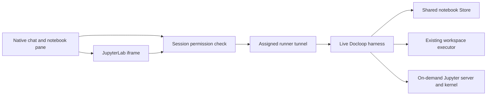

# Docloop notebook pane

The optional notebook pane edits the document used by an existing Docloop session.
Chat keeps its normal composer, model selection, turn stream and tool dispatcher.
On narrow screens, Chat and Notebook are separate views; on wider screens they
appear together. Switching views preserves the composer and unsaved notebook drafts.



## Configuration

This is an opt-in source integration. The central server and each spawned runner
need `docloop_notebook` in `OMNIGENT_FEATURES`. The flag is resolved at process
startup. The optional
[`compose.docloop-notebook.yaml`](../deploy/docker/compose.docloop-notebook.yaml)
overlay enables it on the server while preserving the feature list from `.env`:

```sh
cd deploy/docker
docker compose --env-file .env -f docker-compose.yaml \
  -f compose.docloop-notebook.yaml config
```

Review the rendered `OMNIGENT_FEATURES` before applying the overlay. Applying a
changed environment recreates the server container, so schedule it after active
sessions have drained. Use a published Omnigent image that contains the reviewed
notebook routes; pin its `OMNIGENT_IMAGE_TAG` to that release before the
maintenance window.

The host also needs to pass the non-secret feature switch to the runner. This
release allowlists `OMNIGENT_FEATURES`; the named
`OMNIGENT_RUNNER_ENV_PASSTHROUGH` entries in
[`docloop-runner.env.example`](../deploy/docker/docloop-runner.env.example)
forward the harness settings to runner processes without forwarding the host's
entire environment. Copy the sample to the dedicated runner service's external
environment file and point that service at a **new, versioned virtual
environment**. Do not upgrade the currently running environment in place.

The activation wheel is Docloop 0.2.7, built from main commit `d959973`.
Use the exact artifact and verify its hash before
installing it. Run this in the **new, versioned runner virtual environment**,
never in the environment used by the active runner:

```sh
DOCLOOP_WHEEL=/home/oz/docloop-dogfood/releases/0.2.7-d959973/docloop-0.2.7-py3-none-any.whl
printf '%s  %s\n' \
  eb74402a63c591196a10338c6b655fcf6c377f6ab78b433ceaf0c81ffdf0e434 \
  "$DOCLOOP_WHEEL" | sha256sum --check
python -m pip install \
  "docloop[jupyter,python-state] @ file://$DOCLOOP_WHEEL"
```

The previously deployed Docloop 0.2.6 wheel predates the current integration
fixes; do not install or pin it. Confirm the package exposes
`docloop.codex_cli_config`, JupyterLab and ipykernel are installed, and the
runner's Codex CLI can authenticate with the same per-session `CODEX_HOME` that
will be used by the harness. Keep credentials out of the example environment
file.

The Docloop harness uses its existing `DOCLOOP_DOCUMENT` and workspace
configuration. `DOCLOOP_NATIVE_NOTEBOOK=1` enables its native notebook binding;
the other sample flags select Codex CLI with Luna at max reasoning effort and
enable Python state.

All flags default off. A pane request cannot initialize a new agent process or
select a runner. Start a new session normally and send an initial instruction to
initialize its notebook. Existing runner and harness authentication are reused;
no additional browser token or notebook path is accepted.

### Safe rollout and rollback

1. Create a new, versioned runner virtual environment beside the active one and
   install the compatible Omnigent SDK and supported Codex CLI there.
2. Verify and install the pinned Docloop 0.2.7 wheel above with the
   `[jupyter,python-state]` extras; do not use the older 0.2.6 wheel. Verify the
   imports, JupyterLab/ipykernel versions and Codex authentication under the
   runner service identity.
3. Pin a server image containing the reviewed Omnigent notebook code, render the
   Compose configuration, and confirm the feature list includes
   `docloop_notebook` plus any existing features.
4. Stop dispatching new sessions and wait for active sessions on the old server
   and runner to finish. Apply the server overlay and switch the dedicated
   runner service to the new environment during the same maintenance window.
5. Start a fresh Docloop session and complete the acceptance checks below before
   routing normal use to the updated service.

Rollback by stopping new dispatch, restoring the previous server image and
feature environment, switching the runner service back to its retained previous
virtual environment and environment file, then recreating the server and
restarting the runner after sessions are drained. Both feature snapshots require
process startup, so rollback also needs a maintenance window.

## Save and execution behavior

Both reads and edits require the session's Edit permission. GET and PATCH on
`/v1/sessions/{id}/docloop/document` follow existing session affinity and the live
harness client. The central server has no second document Store. Limits apply
while reading requests and responses; relay redirects and automatic write retries
are disabled.

Edits carry the document binding, revision and a UUID change identifier. Stale
revisions retain the user's draft for comparison. A response lost after dispatch
leaves the save outcome unknown. The user can retry the identical save to obtain
its receipt; this is not an exactly-once delivery guarantee. Docloop retains a
bounded history of edit receipts. A committed edit whose refreshed snapshot is
unavailable is reported as applied, without suggesting a new change identifier.

Use Chat for arbitrary instructions to modify the document, execute cells, or
work with files. With the current Docloop release and its Jupyter extra
installed, ipynb opens in the real JupyterLab editor. Org retains its addressed
source editor.
Run, interrupt, restart, file access and saves travel over the same assigned
runner. The only WebSocket addition is the session's kernel-channel path.
Jupyter's server token stays inside the harness; browser credentials are not
forwarded across transport hops. Compressed responses and split Unicode chunks
are carried losslessly by the tunnel.

Jupyter uses the configured local workspace, with a separate Python kernel from
agent cell evaluation. Saved notebook state and files are shared. OCI environments
retain Source/Chat execution; this native Lab kernel is currently local only.
Native iframes require the normal browser cookie or authenticated proxy session.
Embeds using only JavaScript host headers retain Source and Chat, and explain how
to open the session directly for Jupyter. No new login token or grant is issued.

The pane stays mounted across Chat/Notebook switches. Narrow panes use Jupyter's
simple layout with collapsed sidebars, and show kernel status above the editor.

## Verification

The relay and permission tests use real host route factories and SQLite session
permissions. Cross-project Docloop acceptance uses the real SDK, Engine, Store,
local evaluator and both host relay adapters. Its provider and live process
registry entry are fixtures, and its HTTP hops use ASGI transports.

After adopting both reviewed components, open a new initialized Docloop session,
confirm the Notebook pane appears, change and save a note, then ask in Chat to
use that note and execute a saved cell. Confirm the output and created file,
reload the page, and verify that both survive. Check phone-width switching and a
desktop split view. Local source tests and UI previews do not establish a live
deployment receipt.

The companion Docloop `tests/test_runner_jupyter.py` runs actual Jupyter and SDK
HTTP/WebSockets through a private Unix socket, both relays and the actual tunnel
frame handlers. Its carrier and session metadata are fixtures. It verifies real
code execution, workspace files, versioned saves, two-editor conflicts, restart
and process cleanup. Browser previews exercise the built UI's Run and Save
buttons and retain the kernel while switching to Chat. Physical Android and live
fleet adoption remain separate acceptance steps.
